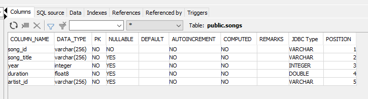

# Project: Data Lake

## Introduction
A music streaming startup, Sparkify, has grown their user base and song database even more and want to move their data warehouse to a data lake. Their data resides in S3, in a directory of JSON logs on user activity on the app, as well as a directory with JSON metadata on the songs in their app.

As their data engineer, you are tasked with building an ETL pipeline that extracts their data from S3, processes them using Spark, and loads the data back into S3 as a set of dimensional tables. This will allow their analytics team to continue finding insights in what songs their users are listening to.

You'll be able to test your database and ETL pipeline by running queries given to you by the analytics team from Sparkify and compare your results with their expected results.

Project Description
In this project, you'll apply what you've learned on Spark and data lakes to build an ETL pipeline for a data lake hosted on S3. To complete the project, you will need to load data from S3, process the data into analytics tables using Spark, and load them back into S3. You'll deploy this Spark process on a cluster using AWS.

## Project Datasets
You'll be working with two datasets that reside in S3 AWS (or your own bucket).
The file schema  `s3a`, `s3n`, `s3` (Native S3 File System could specify in configuration properties)

Recommend: `s3a` (refer https://github.com/jupyter/docker-stacks/issues/127)
- Song data: `s3a://udacity-dend/song_data`
- Log data: `s3a://udacity-dend/log_data`


## Schema for Song Play Analysis
**Fact Table**:
- `songplays` - records in event data associated with song plays i.e. records with page `NextSong`
  

**Dimension Tables**:
- `users`

  

- `songs` - songs in music database

  

- `artists` - artists in music database

  

- `time` - timestamps of records in songplays broken down into specific units

  


## Setup Local Environment
1. Install python https://www.python.org/downloads/
2. Install pip (If your Python environment does not have pip installed) https://pip.pypa.io/en/stable/installation/
3. Install `jupyter notebook` https://jupyter.org/install
```
pip install notebook
```
4. Install AWS SDK
```
pip install boto3
```
5. Install pyspark
```
pip install pyspark
```
6. Install yaml (love to refer YAML)
```
pip install PyYaml
```


## Setup Configurations
Provide relevant configuration info of AWS (S3, AIM) following session `Introduction to Cloud Computing and AWS` in Udacity
- Creating IAM role user (_`ACCESS_KEY_ID` & `SECRET_ACCESS_KEY` are used for accessing AWS S3. Import them into OS environment_)
- Creating an S3 bucket (_could be uploading some sample data to test your own bucket or use uadcity resources_)
- Replace corresponding parameters in `resrouce/dwh.yml`

### Config Local
- Get Apache Hadoop (https://hadoop.apache.org/releases.html or https://mvnrepository.com/artifact/org.apache.hadoop/hadoop-aws) 
- Specify Set the system environment variable `%HADOOP_HOME%` to point to `bin` directory of `hadoop`
- Windows only: download the binaries (https://github.com/kontext-tech/winutils) then extract libs and `WINUTILS.EXE` into `bin` directory (refer https://stackoverflow.com/questions/19620642/failed-to-locate-the-winutils-binary-in-the-hadoop-binary-path)
- Note: `Apache Hadoop 3.3 and upper supports Java 8 and Java 11 (runtime only)` (refer https://cwiki.apache.org/confluence/display/HADOOP/Hadoop+Java+Versions)


### Introduction
- `resource_reader.py`: Establish AWS clients & resources (S3 resource service).
- `sql_queries.py`: contains query definition of each table schema, you could design your desired schema by editing queries
- `etl.py`: creat spark session, process song data & log data files
- `etl.ipynb`: demo & result

## How To Run
* Run `main()`
* Run `etl.ipynb` via `jupyter notebook`

## Reference
* https://knowledge.udacity.com/
* https://sparkbyexamples.com/
* Credit & inheritance: stackoverflow, github
