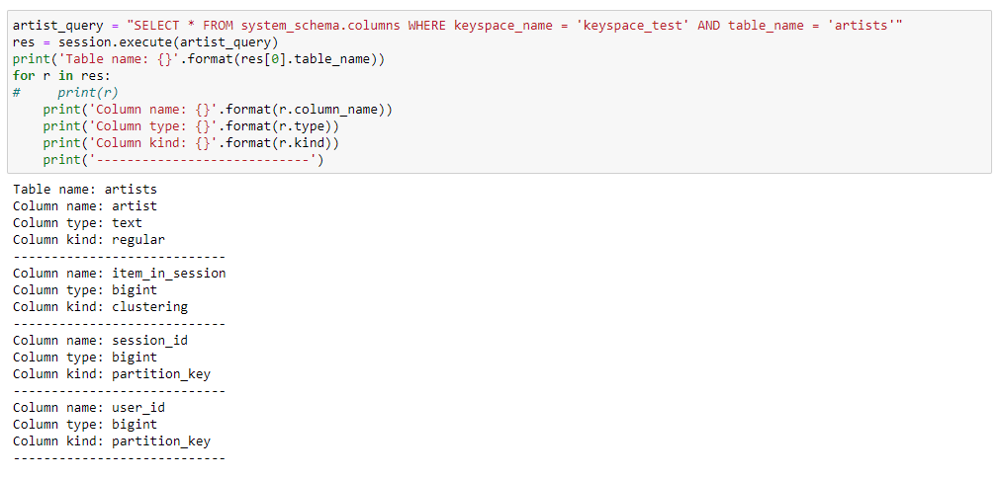

# Project: Data Modeling with Apache Cassandra

## Project: Data Modeling with Apache Cassandra
A startup called Sparkify wants to analyze the data they've been collecting on songs and user activity on their new music streaming app. The analysis team is particularly interested in understanding what songs users are listening to. Currently, there is no easy way to query the data to generate the results, since the data reside in a directory of CSV files on user activity on the app.
They'd like a data engineer to create an Apache Cassandra database which can create queries on song play data to answer the questions, and wish to bring you on the project. Your role is to create a database for this analysis. You'll be able to test your database by running queries given to you by the analytics team from Sparkify to create the results.


## Project Description
In this project, you'll apply what you've learned on data modeling with Apache Cassandra and complete an ETL pipeline using Python.
To model your data by creating tables in Apache Cassandra to run queries. You are provided with part of the ETL pipeline that transfers data from a set of CSV files within a directory to create a streamlined CSV file to model and insert data into Apache Cassandra tables.

## Schema Apache Cassandra tables



## Event Data Collection


## Setup Local Environment
1. Install python https://www.python.org/downloads/
2. Download & install Cassandra https://cassandra.apache.org/_/download.html
3. Install pip (If your Python environment does not have pip installed) https://pip.pypa.io/en/stable/installation/
4. Install `jupyter notebook` https://jupyter.org/install
```
pip install notebook
```
4. Install cassandra
```
pip install cassandra
```

## Project resources
- `queries.py` - definnition of Cassandra table schema (create queries, drop queries, select queries), constants
- `create_tables.py` - functions of creating, drop, and starting/shutdown cluster & session 
- include `main()` for test locally

## How to run project locally
* Start Apache Cassandra (execute `cassandra` in `/bin` folder)
* Run `main()` in `etl.py`
---
* Start `jupyter notebook`
* Run via `Project_1B_ Project_Template.ipynb`

