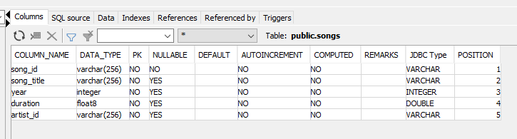
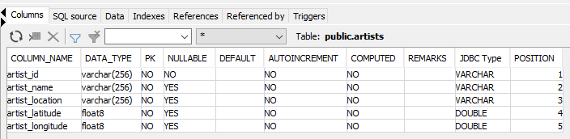
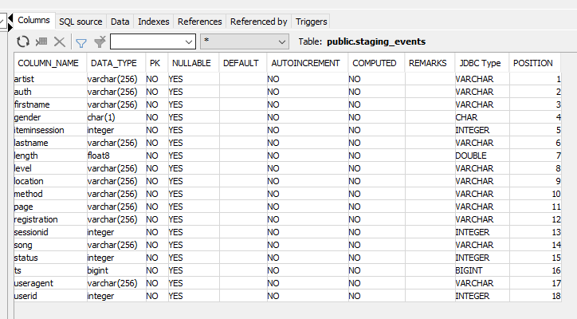
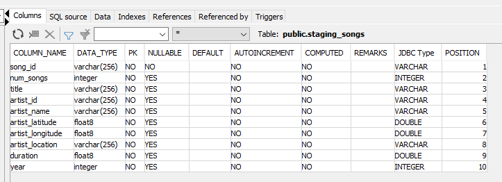

# Project: Data Warehouse

## Introduction
A music streaming startup, Sparkify, has grown their user base and song database and want to move their processes and data onto the cloud. Their data resides in S3, in a directory of JSON logs on user activity on the app, as well as a directory with JSON metadata on the songs in their app.

As their data engineer, you are tasked with building an ETL pipeline that extracts their data from S3, stages them in Redshift, and transforms data into a set of dimensional tables for their analytics team to continue finding insights into what songs their users are listening to. You'll be able to test your database and ETL pipeline by running queries given to you by the analytics team from Sparkify and compare your results with their expected results.

## Project Description
In this project, you'll apply what you've learned on data warehouses and AWS to build an ETL pipeline for a database hosted on Redshift. To complete the project, you will need to load data from S3 to staging tables on Redshift and execute SQL statements that create the analytics tables from these staging tables.


## Project Datasets
You'll be working with two datasets that reside in S3 AWS.

- Song data: `s3://udacity-dend/song_data`
- Log data: `s3://udacity-dend/log_data`
- Log data json path: `s3://udacity-dend/log_json_path.json`


## Schema for Song Play Analysis
**Fact Table**:
- `songplays` - records in event data associated with song plays i.e. records with page `NextSong`
  

**Dimension Tables**:
- `users` - users in the app
  
- `songs` - songs in music database
  
- `artists` - artists in music database
  
- `time` - timestamps of records in songplays broken down into specific units
  

**Staging tables**:
_Fetching staging data from AWS S3 as requirement_
- `staging_events` collection of staging event logging data locates in `s3://myeyesbucket.test/log_data` following structure defined `log_json_path.json`
  
- `staging_songs`  collection of staging song data locates `s3://myeyesbucket.test/song_data/`
  


## Setup Local Environment
1. Install python https://www.python.org/downloads/
2. Download any DBMS (e.g SQL Workbench, DBeaver...) 
3. Download & import Redshift JDBC into DBMS in step 2 (e.g `redshift-jdbc42-2.1.0.9.jar`)
4. Install pip (If your Python environment does not have pip installed) https://pip.pypa.io/en/stable/installation/
5. Install `jupyter notebook` https://jupyter.org/install
```
pip install notebook
```
6.Install AWS SDK
```
pip install boto3
```
7Install yaml (love to refer YAML)
```
 pip install PyYaml
```

## Setup Configurations
Provide relevant configuration info of AWS (Redshift, S3, AIM, EC2) following session `Introduction to Cloud Computing and AWS` in Udacity
- Creating an IAM role (_create IAM role & get ARN that uses for other related services, attach this role to created cluster_)
- Creating IAM role user (_note `ACCESS_KEY_ID` & `SECRET_ACCESS_KEY` & DOT NOT FORGET grant his permission as privilege otherwise you got error code `401`_)
- Creating a security group (_create & configure group policy. Attach group policy to VPC in EC2_)
- Launching a Redshift Cluster (_create Redshift cluster, set IAM role_)
- Creating an S3 bucket (_could be uploading some sample data to test your own bucket. Note that staging data in UDACITY bucket costs too much time_)
- Creating a PostgreSQL Database
- Replace corresponding parameters in `resrouce/dwh.yml`

### Introduction
- `resource_reader.py`: Establish AWS clients & resources
- `create_tables.py`: Drops & creates the tables defined in `drop_table_queries` & `create_table_queries` list.
- `etl.py`: Test migration of staging data which locate in S3 (refer "Project Datasets" section) to your staging tables Database and process & insert them into Fact & Dimension tables.

## How To Run
* Run `main()`
* Run `test.ipynb` via `jupyter notebook`

## Reference
* https://boto3.amazonaws.com/v1/documentation/api/latest/reference/services/index.html
* https://knowledge.udacity.com/
* Credit & inheritance: stackoverflow, github
