## Project: Data Pipelines with Airflow
A music streaming company, Sparkify, has decided that it is time to introduce more automation and monitoring to their data warehouse ETL pipelines and come to the conclusion that the best tool to achieve this is Apache Airflow.

They have decided to bring you into the project and expect you to create high grade data pipelines that are dynamic and built from reusable tasks, can be monitored, and allow easy backfills. They have also noted that the data quality plays a big part when analyses are executed on top the data warehouse and want to run tests against their datasets after the ETL steps have been executed to catch any discrepancies in the datasets.

The source data resides in S3 and needs to be processed in Sparkify's data warehouse in Amazon Redshift. The source datasets consist of JSON logs that tell about user activity in the application and JSON metadata about the songs the users listen to.

## Project Datasets
For this project, you'll be working with two datasets. Here are the s3 links for each:

- Log data: `s3://udacity-dend/log_data`
- Song data: `s3://udacity-dend/song_data`


## Schema for Song Play Analysis
**Fact Table**:
- `songplays` - records in event data associated with song plays i.e. records with page `NextSong`
- 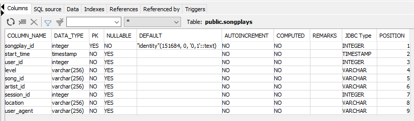

**Dimension Tables**:
- `users` - users in the app
- 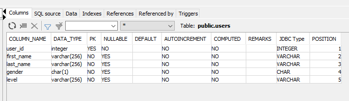
- `songs` - songs in music database
- 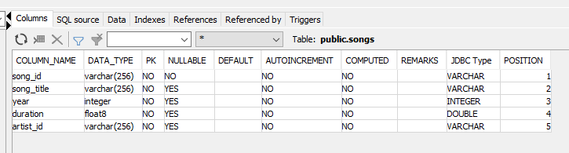
- `artists` - artists in music database
- 
- `time` - timestamps of records in songplays broken down into specific units
- 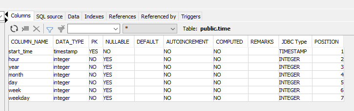


## Configuring the DAG
Init default parameters in `udag_example_dag.py`
- The DAG does not have dependencies on past runs
- On failure, the task are retried 3 times
- Retries happen every 5 minutes
- Catchup is turned off
- Do not email on retry
```
default_args = {
    'owner': 'udacity',
    'start_date': datetime(2022, 10, 10),
    'depends_on_past': False
    'retries': 3,
    'retry_delay': timedelta(minutes=5),
    'catchup': False,
    'email_on_retry': False
}
```


## Setup Local Environment
WINDOWS (ignore those step if you are using Linux, MACOS, Docker):
- Turns on `Windows Subsystem for Linux` (WSL)

- 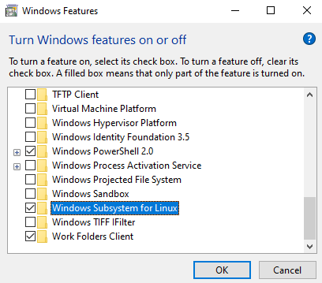
- install Ubuntu (from Microsoft Store)
- Install Python & pip
- enable sudo apt install python-is-python3
- set AIRFLOW_HOME in ~/.bashrc
  E.g `export AIRFLOW_HOME=/d/<your ABS path>/airflow-workspace`

### Docker
Refer the instruction at https://airflow.apache.org/docs/apache-airflow/stable/howto/docker-compose/index.html

- install apache-airflow
```
https://github.com/apache/airflow/blob/main/README.md#installing-from-pypi
````
E.g: `pip install "apache-airflow[postgres,amazon]==2.4.0" --constraint "https://raw.githubusercontent.com/apache/airflow/constraints-2.4.0/constraints-3.7.txt"`
Specify desired providers in square brackets `[postgres,amazon]`
Replace `constraints-3.7.txt` your python version, recommend from airflow python 3.7
Note airflow `2.4.0` and above some packages in template of Udacity are obsoleted. Airflow 1.10.10 in used in AWS workspace
refer https://pypi.org/project/apache-airflow-backport-providers-amazon/

- Create airflow user to login airflow web server
```
  # create an admin user
airflow users create \
--username admin \
--firstname Peter \
--lastname Parker \
--role Admin \
--email spiderman@superhero.org
```
- Follow instruction of user creation, set the account's password
- Set `AUTH_ROLE_PUBLIC = 'Admin'` in `$AIRFLOW_HOME/webserver_config.py` (https://airflow.apache.org/docs/apache-airflow/stable/security/webserver.html#web-authentication)

### Screenshots airflow in AWS workspace

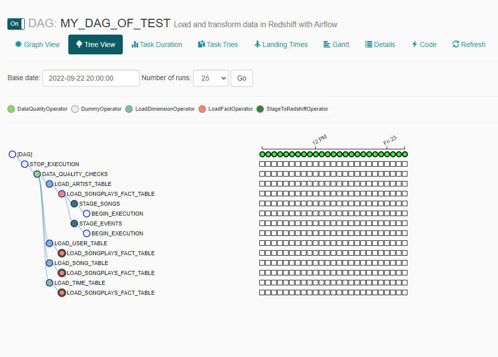
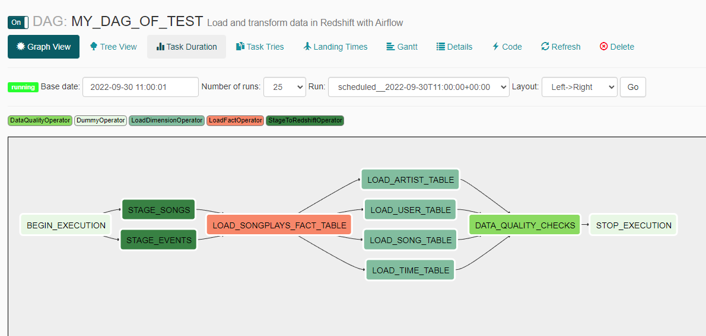

## Setup AWS
Provide relevant configuration info of AWS (S3, AIM, AWS Redshift Cluster) following session `Introduction to Cloud Computing and AWS` in Udacity
Follow the steps on the page Create an IAM User, AWS Redshift Cluster, and S3 in AWS in the lesson Data Pipelines
- Create IAM role user (_Store`ACCESS_KEY_ID` & `SECRET_ACCESS_KEY` that are used for accessing AWS S3. Import them into OS environment_)
- Create Redshift Cluster for your account
- Use Udicity S3 resource or creating an S3 bucket (_could be uploading some sample data for your test instead_)

## How To Run
Note these commands below (airflow v2.4.0 and above), need to recharge airflow deprecated command of v1.10.2 (Udacity AWS workspace Oct 2022)
- Run `airflow db init`
- Run `airflow webserver` (we can specify port number with `airflow webserver -p XXXX`)
- Open another ubuntu session
- Run `airflow scheduler`
- Launch Web UI url `localhost:8080` or `127.0.0.1:8080` (refer port number in previous step)
- Login as created credential
- Turn on your DAG

### Airflow Web UI 
* Go to `Admin` > `Connections` menu
- 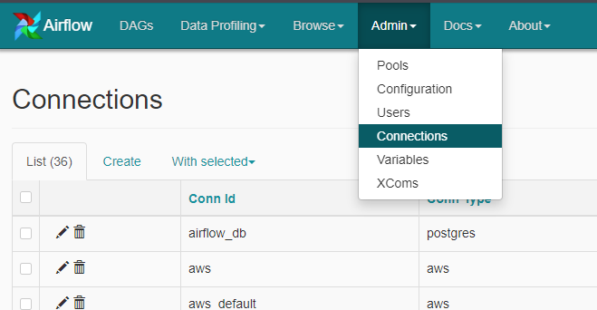
1. Add connection of your redshift cluster naming `redshift_conn`
- 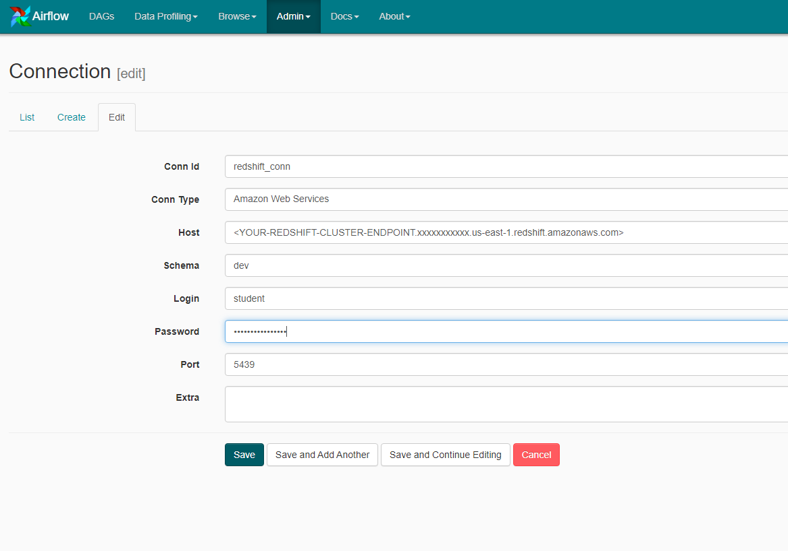
2. Add connection of your AWS credentials naming `aws_credential`
- 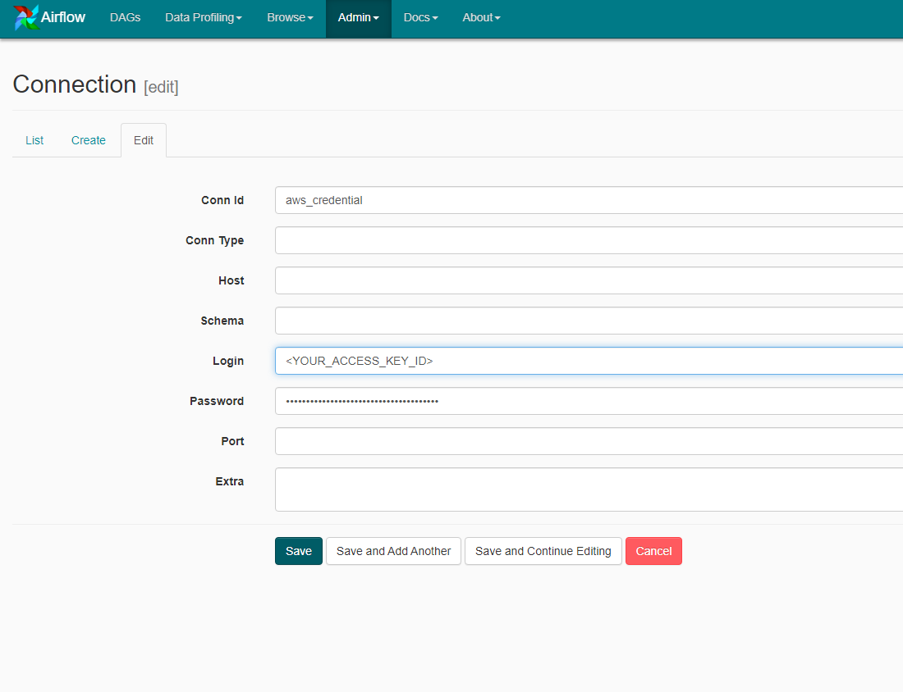
3. Implement your codes and copy them to `$AIRFLOW_HOME` (airflow workspace, execute `echo $AIRFLOW_HOME` check your workspace)
- e.g:  
```
root@QNH:~# echo $AIRFLOW_HOME
/root/airflow
```
- Udacity AWS workspace
`/home/workspace/airflow`
- Note: add your airflow `operators`, `helpers` definition in 
- `plugins/__init__.py`
```
...
class UdacityPlugin(AirflowPlugin):
    name = "udacity_plugin"
    operators = [
        operators.StageToRedshiftOperator,
        operators.LoadFactOperator,
        operators.LoadDimensionOperator,
        operators.DataQualityOperator
        #operators.<YourSampleOperatorHere>
    ]
    helpers = [
        helpers.SqlQueries,
        helpers.YourLibs
    ]
```
- `plugins/operators/__init__.py`
```
__all__ = [
    'StageToRedshiftOperator',
    'LoadFactOperator',
    'LoadDimensionOperator',
    'DataQualityOperator'
    #'<YourSampleOperatorHere>'
]
```

## Troubleshooting
### Some common errors on Udacity AWS workspace: 
- [Broken DAG: [/home/workspace/airflow/dags/udac_example_dag.py] cannot import name 'StageToRedshiftOperator](https://knowledge.udacity.com/?nanodegree=nd027&page=1&project=565&query=Broken%20DAG%3A%20%5B%2Fhome%2Fworkspace%2Fairflow%2Fdags%2Fudac_example_dag.py%5D%20cannot%20import%20name%20%27StageToRedshiftOperator%27&rubric=2478)
=> Attempt refresh or restart Airflow server to be able to fetch the operator script.
- OR list all pid of airflow webserver ```ps aux | grep airflow-webserver``` even airflow scheduler
- Kill all PIDs of airflow webserver ```kill <pid>```
- Start `/opt/airflow/start.sh`
### Restart LOCAL airflow webserver
- Check PID on your local `cat $AIRFLOW_HOME/airflow-webserver.pid`
- Kill all PIDs of airflow webserver ```kill <pid>```
- Run `airflow webserver` & `airflow scheduler`
### Udacity AWS workspace
- Refresh Workspace sometime
- 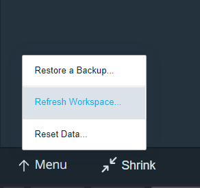
- OR execute `cat /root/airflow/airflow-webserver.pid | xargs kill -9` then `/opt/airflow/start.sh`

## Reference
* https://knowledge.udacity.com/
* Credit & inheritance: stackoverflow, github, youtube
